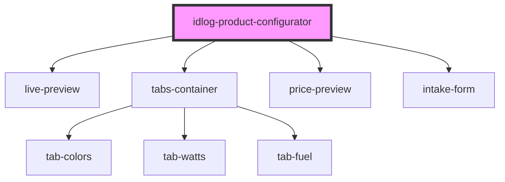

# idlog-product-configurator

## Usage

```html
<idlog-product-configurator mode="2d" org-id="{ORG_ID}" config-id="{CONFIG_ID}"></idlog-product-configurator>
```

<!-- Auto Generated Below -->


## Properties

| Property                | Attribute         | Description                                                                                                                                  | Type           | Default                           |
| ----------------------- | ----------------- | -------------------------------------------------------------------------------------------------------------------------------------------- | -------------- | --------------------------------- |
| `apiUrl`                | `api-url`         | The iDialogue API URL that the configurator would communicate with.                                                                          | `string`       | `'https://api.i-dialogue.com/v1'` |
| `baseUrl` _(required)_  | `base-url`        | The base URL of the assets used by the configurator.                                                                                         | `string`       | `undefined`                       |
| `configId` _(required)_ | `config-id`       | The ID of the template or configuration that the configurator would use to load the initial configuration options.                           | `string`       | `undefined`                       |
| `crmId`                 | `crm-id`          | The Lead ID. If empty, it'll auto-create one when the user interacts with the configurator for the first time.                               | `string`       | `undefined`                       |
| `forceMobile`           | `force-mobile`    | Force mobile layout view, primarily used by the portal builder to preview the mobile view of the configurator.                               | `boolean`      | `false`                           |
| `isPreviewMode`         | `is-preview-mode` | If preview mode is enabled, the configurator will not send any events/requests to the API endpoint                                           | `boolean`      | `false`                           |
| `itemId`                | `item-id`         | The item ID of the configuration plugin that is loaded in a particular room.                                                                 | `string`       | `undefined`                       |
| `memberId`              | `member-id`       | The member ID of the current user in the room.                                                                                               | `string`       | `undefined`                       |
| `mode`                  | `mode`            | The configurator mode. Note: 3D models are not included in this repository.                                                                  | `"2d" \| "3d"` | `'2d'`                            |
| `orgId` _(required)_    | `org-id`          | The Salesforce OrgID that the configurator would use to fetch configurations, and the Salesforce Org that the configurator would save leads. | `string`       | `undefined`                       |
| `roomId`                | `room-id`         | The room ID to associate the configuration with.                                                                                             | `string`       | `undefined`                       |
| `user`                  | `user`            | A string representation of a JSON object that contains the current user's details, which would be used to pre-fill the Quotation Form.       | `string`       | `undefined`                       |


## Dependencies

### Depends on

- [live-preview](../live-preview)
- [tabs-container](../tabs-container)
- [price-preview](../price-preview)
- [intake-form](../intake-form)

### Graph


----------------------------------------------

*Built with [StencilJS](https://stenciljs.com/)*