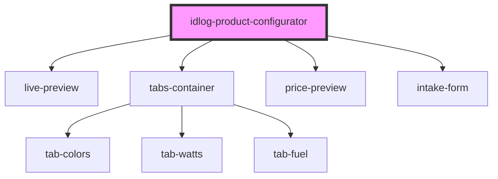

# idlog-product-configurator

<!-- Auto Generated Below -->

## Properties

| Property        | Attribute         | Description | Type      | Default                           |
| --------------- | ----------------- | ----------- | --------- | --------------------------------- |
| `apiUrl`        | `api-url`         |             | `string`  | `'https://api.i-dialogue.com/v1'` |
| `baseUrl`       | `base-url`        |             | `string`  | `location.origin`                 |
| `configId`      | `config-id`       |             | `string`  | `undefined`                       |
| `crmId`         | `crm-id`          |             | `string`  | `undefined`                       |
| `forceMobile`   | `force-mobile`    |             | `boolean` | `false`                           |
| `isPreviewMode` | `is-preview-mode` |             | `boolean` | `false`                           |
| `itemId`        | `item-id`         |             | `string`  | `''`                              |
| `memberId`      | `member-id`       |             | `string`  | `''`                              |
| `mode`          | `mode`            |             | `string`  | `'2d'`                            |
| `orgId`         | `org-id`          |             | `string`  | `undefined`                       |
| `roomId`        | `room-id`         |             | `string`  | `''`                              |
| `user`          | `user`            |             | `string`  | `undefined`                       |

## Dependencies

### Depends on

- [live-preview](../live-preview)
- [tabs-container](../tabs-container)
- [price-preview](../price-preview)
- [intake-form](../intake-form)

### Graph

----------------------------------------------

*Built with [StencilJS](https://stenciljs.com/)*