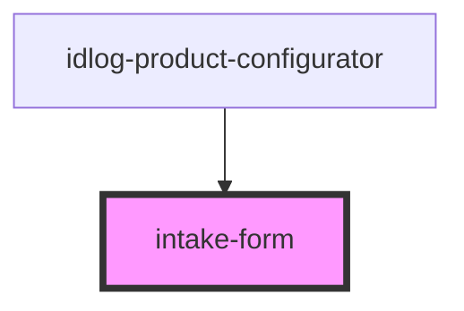

# intake-form

<!-- Auto Generated Below -->

## Properties

| Property | Attribute | Description | Type      | Default |
| -------- | --------- | ----------- | --------- | ------- |
| `isOpen` | `is-open` |             | `boolean` | `false` |
| `user`   | --        |             | `IUser`   | `{}`    |

## Events

| Event         | Description | Type                 |
| ------------- | ----------- | -------------------- |
| `requestHide` |             | `CustomEvent<any>`   |
| `requestSave` |             | `CustomEvent<IUser>` |

## Dependencies

### Used by

 - [idlog-product-configurator](../idlog-product-configurator)

### Graph

----------------------------------------------

*Built with [StencilJS](https://stenciljs.com/)*
