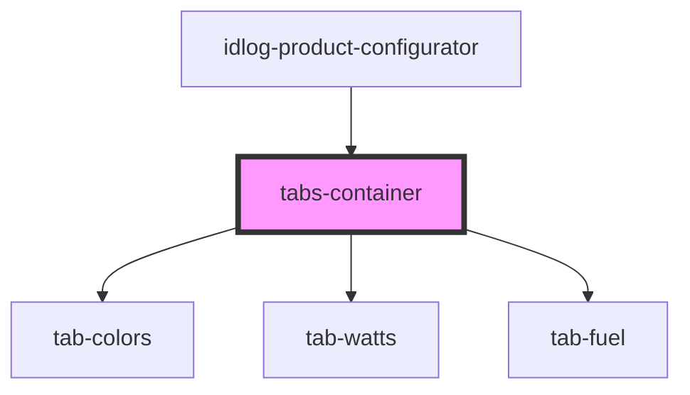

# vertical-tabs

<!-- Auto Generated Below -->

## Properties

| Property      | Attribute      | Description | Type      | Default     |
| ------------- | -------------- | ----------- | --------- | ----------- |
| `cards`       | --             |             | `ICard[]` | `undefined` |
| `forceMobile` | `force-mobile` |             | `boolean` | `false`     |
| `fuel`        | `fuel`         |             | `string`  | `undefined` |
| `mode`        | `mode`         |             | `string`  | `'2d'`      |

## Dependencies

### Used by

 - [idlog-product-configurator](../idlog-product-configurator)

### Depends on

- [tab-colors](../tabs/tab-colors)
- [tab-watts](../tabs/tab-watts)
- [tab-fuel](../tabs/tab-fuel)

### Graph

----------------------------------------------

*Built with [StencilJS](https://stenciljs.com/)*
