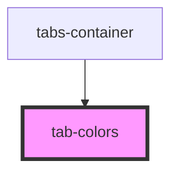

# tab-colors

<!-- Auto Generated Below -->

## Properties

| Property  | Attribute | Description | Type        | Default     |
| --------- | --------- | ----------- | ----------- | ----------- |
| `mode`    | `mode`    |             | `string`    | `'2d'`      |
| `options` | --        |             | `IOption[]` | `undefined` |

## Events

| Event         | Description | Type                  |
| ------------- | ----------- | --------------------- |
| `colorChange` |             | `CustomEvent<string>` |

## Dependencies

### Used by

 - [tabs-container](../../tabs-container)

### Graph

----------------------------------------------

*Built with [StencilJS](https://stenciljs.com/)*
