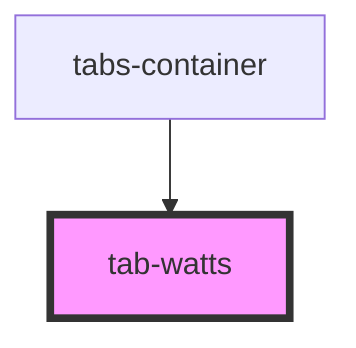

# tab-watts

<!-- Auto Generated Below -->

## Properties

| Property  | Attribute | Description | Type        | Default     |
| --------- | --------- | ----------- | ----------- | ----------- |
| `fuel`    | `fuel`    |             | `string`    | `undefined` |
| `options` | --        |             | `IOption[]` | `undefined` |

## Events

| Event         | Description | Type                            |
| ------------- | ----------- | ------------------------------- |
| `wattsChange` |             | `CustomEvent<IWattChangeEvent>` |

## Dependencies

### Used by

 - [tabs-container](../../tabs-container)

### Graph

----------------------------------------------

*Built with [StencilJS](https://stenciljs.com/)*
